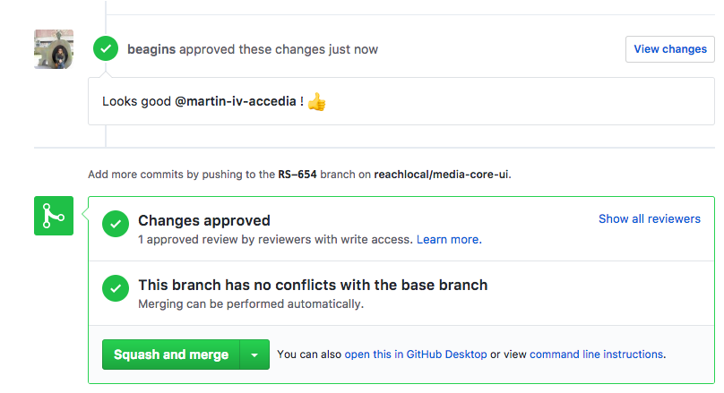
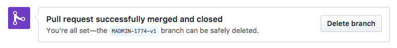
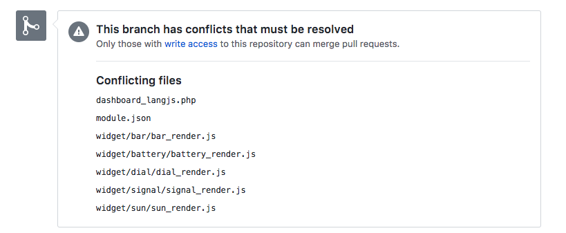

# Definition of Done
*...things to do to get to done*

## In general
 - Prefer small frequent PRs to large less frequent PRs
 - Name the PR [`<JIRA Ticket Number>`] Name (ex. [RS-642] Start send logs to service)
   * You can open a PR before the functionality is complete by naming the PR wip [`<JIRA Ticket Number>`] Name...  This allows you to get feedback while you are still working on a ticket.  
 - When you pull to your local branches always do a rebase
 - Prefer Test Driven Development (TDD) and write unit tests first
 - Fixing a bug?  Write a failing unit test first!

## Done

| Step                 | Command            | Notes |
| :------------------: | ------------------ | ----- |
| Lint                 | npm run lint       | Set up lints to run in your editor or on a command line as you type in your code. |
| Write unit tests     |                    | Write positive and negative tests for all external functions. See [Karma Website](https://karma-runner.github.io/1.0/index.html) and [AngularJs Unit Testing](https://docs.angularjs.org/guide/unit-testing).  *Any PR with javascript changes should have corresponding unit test changes* |
| Write code           |                    | Follow the [Todd Motto Styleguide](https://github.com/toddmotto/angular-styleguide#modular-architecture) |
| Internationalize     |                    | Remove hard-coded text from html, css and js and replace with references to lang-en.js files (access with translate directive) |
| Modular SASS         |                    | Each component should isolate its own styling in its own scss file.  Avoid hard-coded colors, !important, z-index. Prefer bootstrap responsiveness |
| Responsive Design |  | Does the front end respond to changes in browser window size? |
| Feature Flags        |                    | Hide incomplete new features with feature flags until changes are accepted |
| Log Messages         |                    | Inject rlLogger and log all errors (fatal faults), warnings (non fatal bad things), info (major changes of state)
| Update Comments      |                    | Make sure any existing comments still make sense.  Adding a common component?  Add a jsdoc comment block to the top explaining how to use it (@usage) including a description of all of the inputs
| Run Karma Tests      | npm run test:unit  | All karma tests should pass, no skipped tests
| Run Protractor Tests | npm run test:e2e   | All protractor tests should pass |
| Run with Mocks       | npm run start:test | Make sure mocks are present and functionality works when running with mocks |
| Run with dev server  | npm start          | If practical, run on localhost while running gateways and server on localhost as well to ensure it all still runs |
| Pull and Rebase from Master | git pull --rebase,  or your favorite git tool | Pull and rebase from the current master branch (See [Git Rebasing](https://git-scm.com/book/en/v2/Git-Branching-Rebasing)) then make sure it still lints, passes tests, builds and runs before you make your PR |
|<td colspan=3>AFTER PR APPROVED</td>|
| Squash and Merge </br> or </br> Rebase and Merge | | If there are no merge conflicts you can squash and merge and delete the branch right from the PR view.  [See Merging Approved PRs](#merging-approved-prs)
| Delete Branch | | Keep the repo clean by deleting branches after they are merged|

## Modular SASS

#### Component-only Styles in `<component>.scss` file
Each component is wrapped in an outer div with a unique class to isolate the styling within the component and avoid leaking local styles into the global name space.

Styling specific to the component is defined in the <component-name>.scss file.


We wrap each component template in `<div class="rl-{SOMENAME}">` for namespacing.  Then define our styling within the corresponding class.

Example HTML:

```html
  <div class="rl-search-dashboard">
    <div class="rl-container">
      <div class="rl-content">
         ...
      </div>
    </div>
  </div>
```

Corresponding <component-name>.scss:

```scss
.rl-search-dashboard {
  .rl-container {
     // The styles you define in here will only apply to the
     // .rl-container elements within the search-dashboard.
     // They will not apply to other .rl-container elements
     // other places in the app.
  }
}
```

#### Basic Responsiveness
Typically, we do not have designs for phone or tablet sized layout.  Our users view our app on a desktop or laptop.  However we want to build a generally responsive app such that changing the size of the browser window doesn't make things look horrible or become unusable.  

For this reason we prefer to use Bootstrap 3's grid system to hard coding widths.  [See Bootstrap 3 page](http://getbootstrap.com/css/)

The rule of thumb here is before you make your PR, run your code and change the browser window size to see that everything still looks okay.

#### Things to Avoid
##### !important
Prefer changing the specificity in the style definition to using !important
*if you use `!important` add a comment explaining why it is needed*
##### z-index
Prefer changing the DOM order to explicitly setting the z-index. [See Stacking without z-index](https://developer.mozilla.org/en-US/docs/Web/CSS/CSS_Positioning/Understanding_z_index/Stacking_without_z-index)

## Merging Approved PRs

#### No Merge Conflicts
If there are no merge conficts, once your PR is approved it will show a Squash and Merge button.


Once you push the Squash and Merge button, you should see a Delete Branch button.  To keep our repo clean push this button.


#### Merge conflicts
If the branch currently has conflicts with master, you will see a messages indicating the conflicts.  


In this case, you will need to pull the current master and rebase.  Quickly run through the checklist above again to make sure that it still lints, passes tests, builds and functions.  Then squash and merge and delete the branch.
